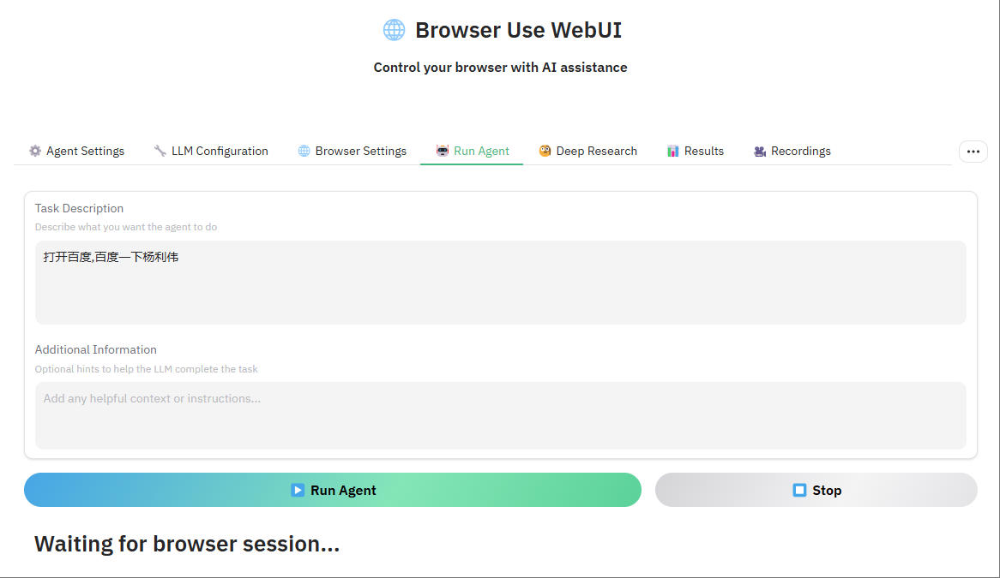

# browser-use

::: tip browser-use

* browser-use 让人工智能控制你的浏览器
* [browser use](https://github.com/browser-use/browser-use)
* web ui 是 browser-use的web ui版本
* [web ui](https://github.com/browser-use/web-ui.git)
:::

## 安装

```bash
git clone https://github.com/browser-use/web-ui.git

cd web-ui

uv init --python 3.11
uv run  # 会根据.python-version中的python版本生成 .venv文件，即python虚拟环境

# 将旧依赖方式同步到pyproject.toml中
uv add -r requirements.txt

./.venv/Scripts/activate

# 安装playwright
playwright install

```

## 配置

```bash
copy .env.example .env
# 修改.env中的配置
DEEPSEEK_ENDPOINT=https://api.deepseek.com
DEEPSEEK_API_KEY=sk-xxxx

```

## 运行

```bash
python webui.py --ip 127.0.0.1 --port 7788
```


