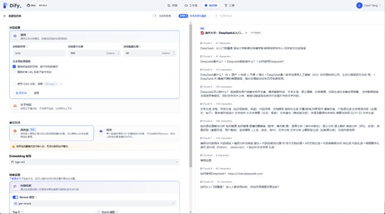

# dify

::: tip 简介

* Dify 是一个开源的 AI 应用开发平台，旨在帮助开发者快速构建和部署基于大模型的 AI 应用。它提供了丰富的工具和接口，支持多种大模型（如 GPT、LLaMA 等），并简化了从模型选择到应用上线的全流程。
* [dify](https://github.com/langgenius/dify.git)
:::

## 安装

```bash
git clone https://github.com/langgenius/dify.git
cd dify
cd docker
cp .env.example .env
docker compose up -d
```

## 配置dify模型

:::tip 注意

* 使用ollama安装deepseek 和 bge-m3模型
* 一定要安装 bge-m3 文本嵌入模型,不然无法启用高质量嵌入
:::


## 上传文档作为知识库



## 使用


