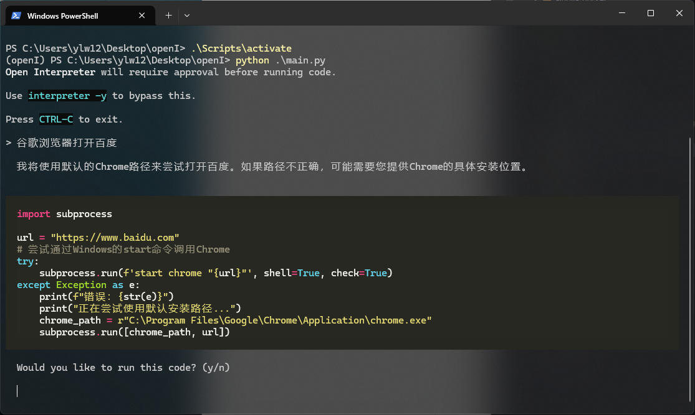

# open-interpreter

::: tip 简介

* open-interpreter 让语言模型在您的计算机上运行代码。
* 可以在您的计算机上运行代码，无需任何编程经验。
:::

## 安装

```bash
pip install open-interpreter
```

## 配置

```python
from interpreter import interpreter
def main():
    interpreter.offline = False
    interpreter.loop = True
    interpreter.max_output=1000
    # 如果不是 openai 的话，需要加上openai/前缀
    interpreter.llm.model = "openai/deepseek-r1"
    interpreter.llm.api_key = "sk-2435"
    interpreter.llm.api_base = "https://dashscope.aliyuncs.com/compatible-mode/v1"
    interpreter.llm.context_window = 3000
    # 自动执行
    # interpreter.auto_run = True

    # Start an interactive chat session
    interpreter.chat()

if __name__ == "__main__":
    main()

```

## 使用

```bash
 python .\main.py
 ```


