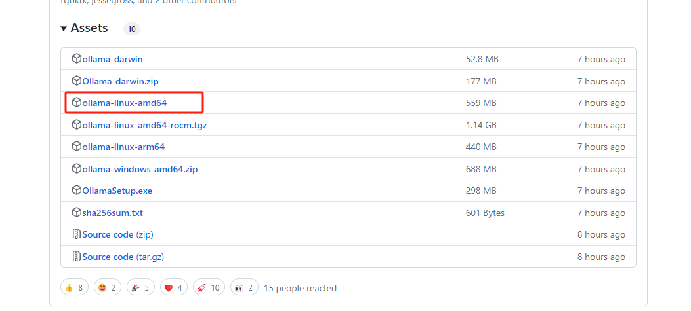
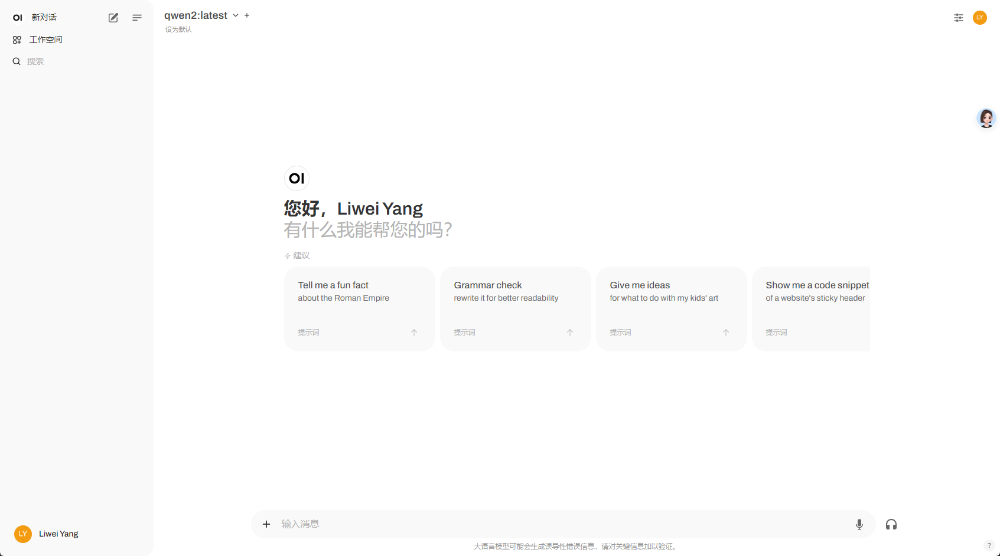

# 本地部署自己的gpt

::: tip

* 使用ollama 部署本地gpt
* 使用openwebui 图形化界面
* 使用nginx代理openwebui
:::

## 安装ollama

```bash

# 安装ollama
# https://ollama.com/download/linux

curl -fsSL https://ollama.com/install.sh | sh

```

:::tip 可能会遇到网络错误下载不下来或者太慢,可以离线安装ollama

* 下载安装包

* 1,进入<https://github.com/ollama/ollama/releases/>

* 2,找到最新版本,下载ollama-linux-amd64 版本

* 3,上传到服务器



* install.sh 脚本

```bash
...
status "Downloading ollama..."
## 在install.sh的第65行
#curl --fail --show-error --location --progress-bar -o $TEMP_DIR/ollama "https://ollama.com/download/ollama-linux-${ARCH}${VER_PARAM}"
...

status "Installing ollama to $BINDIR..."
$SUDO install -o0 -g0 -m755 -d $BINDIR
## 在install.sh的第73行
#$SUDO install -o0 -g0 -m755 $TEMP_DIR/ollama $BINDIR/ollama
$SUDO install -o0 -g0 -m755 ./ollama-linux-amd64  $BINDIR/ollama
...
```

* 运行install.sh脚本

```bash
# 运行install.sh脚本
./install.sh
```

:::

## 下载并运行模型

```bash
# 下载并运行模型
ollama run qwen2
```

## ollama 管理命令

```bash
ollama --help

# 重启ollama
systmctl restart ollama

# 查看ollama状态
systemctl status ollama

# 关闭ollama
systemctl stop ollama

# 启动ollama
systemctl start ollama
```

## 安装openwebui

:::tip 安装openwebui

* 安装openwebui,这里使用本地ollama
* <https://docs.openwebui.com/getting-started/>

```bash
docker run -d -p 3000:8080 --add-host=host.docker.internal:host-gateway -v open-webui:/app/backend/data --name open-webui --restart always ghcr.io/open-webui/open-webui:main
```

:::



## nginx代理

:::tip nginx代理的问题

* nginx 代理很简单,这里遇到一个问题:
* 1,回答完问题后,无法输入下一个问题
* 2,刷新后出现[object Object]错误
* 解决办法:

:::

```bash
#nginx 配置增加如下配置
server {
...
# WebSocket support
proxy_set_header Upgrade $http_upgrade;
proxy_set_header Connection "upgrade";
...
}
```

完整配置如下

```bash
server {
        listen       443 ssl;
        server_name  xxxx.com;
        #charset koi8-r;
        access_log  logs/nginx_sys_h5.log;

        ssl_certificate      /etc/nginx/conf/xxx.pem;
        ssl_certificate_key  /etc/nginx/conf/xxx.key;
        ssl_session_timeout 1440m;
        ssl_protocols TLSv1 TLSv1.1 TLSv1.2 TLSv1.3;
        ssl_prefer_server_ciphers on;
        ssl_session_cache    shared:SSL:1m;
        ssl_ciphers  HIGH:!aNULL:!MD5;
        
        location / {
            proxy_pass http://xxx:xx/;
            proxy_set_header Host $host;
            proxy_set_header Host $host;
            proxy_set_header X-Real-IP $remote_addr;
            proxy_set_header X-Forwarded-For $proxy_add_x_forwarded_for;
            proxy_set_header X-Forwarded-Proto $scheme;
            proxy_buffering off;
            proxy_cache off;
            proxy_http_version 1.1;
            proxy_set_header Upgrade $http_upgrade;
            proxy_set_header Connection "upgrade";
        }
}
```
